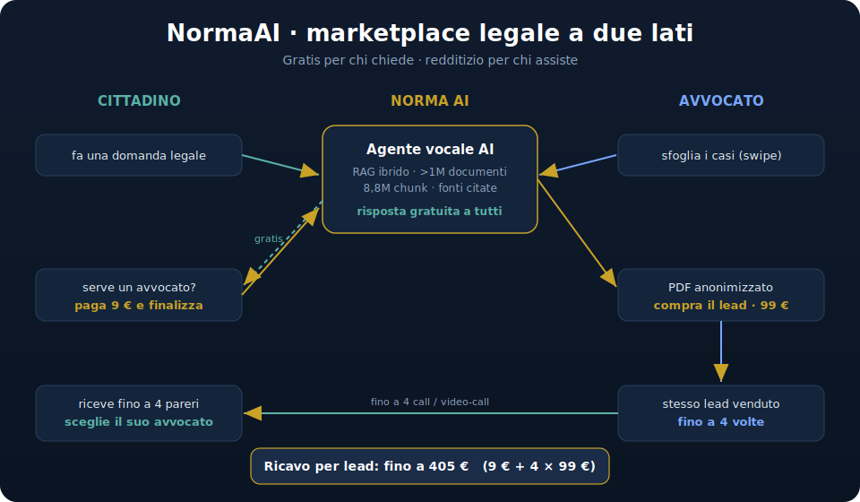

<div align="center">

# ⚖️ NormaAI

### Assistenza legale gratuita per tutti, lead qualificati per gli avvocati.

**Il primo assistente legale vocale AI d'Italia + un marketplace "Tinder dei legali"**
costruito su un motore RAG ibrido che indicizza **oltre 1 milione di documenti normativi italiani** (~8,8 milioni di chunk).

`Next.js 16` · `React 19` · `Supabase + pgvector` · `Claude Sonnet 4.6` · `RAG ibrido` · `Voice AI (Vapi)`

🌐 **[normaai.it](https://normaai.it/)** · 📑 [**Leggi il pitch →**](PITCH.md)

*L'evoluzione AI-native di [avvocatoflash.it](https://www.avvocatoflash.it/) — interamente progettata e costruita con Claude.*

</div>



---

## 🎯 Il problema

In Italia **milioni di cittadini, imprenditori e turisti** ogni anno hanno un dubbio o un problema legale e:

- non sanno **a chi rivolgersi** né **quanto costerà**;
- una prima consulenza costa tempo e denaro, spesso solo per scoprire se vale la pena agire;
- gli **avvocati** (specialmente i giovani e gli apprendisti) faticano a trovare clienti qualificati.

Domanda e offerta non si incontrano. I cittadini rinunciano ai propri diritti, gli avvocati restano senza lavoro.

---

## 💡 La soluzione

Una **piattaforma a due lati** che usa l'AI per abbattere la barriera d'ingresso al mondo legale.

### Lato cittadino — *risolto gratis, sempre*
Un **agente vocale AI** risponde **gratuitamente a chiunque**, fondando ogni risposta su fonti normative reali (niente allucinazioni: ogni risposta cita la legge). Quando il problema **richiede un avvocato umano** (una diffida, una difesa, un mandato), il cittadino paga **9 €** per **finalizzare la richiesta** e accedere al marketplace.

### Lato avvocato — *un marketplace di lead qualificati*
Gli avvocati sfogliano i casi **come su Tinder**: leggono i **PDF anonimizzati** in cui i clienti hanno descritto il problema e già pagato i 9 €. Quando un caso interessa, l'avvocato lo **acquista pagando 99 €**. Ogni lead può essere venduto **fino a 4 volte**.

Il cittadino riceve così **fino a 4 pareri telefonici** e poi **sceglie l'avvocato** con cui difendersi o a cui dare mandato — in base a **competenze, recensioni e qualità del parere ricevuto**.

> È il **Tinder dei legali**: gli avvocati comprano lead per acquisire più clienti e far lavorare gli apprendisti; i cittadini ottengono assistenza gratuita e scelgono il professionista migliore con il rischio quasi azzerato.

---

## 💰 Modello di business & unit economics

Ricavo per **singolo caso finalizzato**:

| Fonte | Importo |
|---|---|
| Cittadino (finalizzazione) | **9 €** |
| Avvocato #1–#4 (acquisto lead) | **4 × 99 €** |
| **Totale potenziale per lead** | **fino a 405 €** |

- **Costo marginale di servizio ≈ 0**: la consulenza gratuita è erogata dall'AI; il valore monetizzabile nasce solo quando c'è reale intenzione d'azione (il filtro dei 9 €).
- **Doppia monetizzazione** dello stesso lead (lato domanda + lato offerta).
- L'assistenza gratuita è il motore di **acquisizione organica** che alimenta il marketplace.

---

## 🧠 Architettura tecnica

### Pipeline dati (il cuore difendibile del prodotto)
1. **Scraping su GPU** della normativa e legislazione italiana — **1.038.456 documenti** sorgente.
2. **Chunking** semantico → **8.842.327 chunk** indicizzati.
3. **Doppio embedding denso** (multilingue + **BGE-M3**) per la ricerca semantica.
4. **Ricerca ibrida**: vettoriale (pgvector) **+** full-text italiano (`tsvector`) per massima precisione.
5. **Versioning temporale del corpus** ("corpus-as-code"): ogni norma è datata, identificata da **URN** e collegata in un **knowledge graph** di relazioni (modifica · abroga · integra) → risposte **point-in-time**, allineate alla legge vigente.
6. **RAG** servito al frontend: ogni risposta è **ancorata a fonti reali e citabili**.

> Dataset proprietario: **>1M documenti / ~8,8M chunk**, doppio embedding, ricerca ibrida e versioning temporale — difficilmente replicabile.

### Stack applicativo
- **Frontend**: Next.js 16 App Router · React 19.
- **DB / Auth / Storage**: Supabase Postgres + **pgvector**.
- **LLM**: Claude Sonnet 4.6 (via OpenRouter).
- **Voice**: Vapi (orb mobile) + Audio2Face NIM (avatar desktop — fase 2).
- **Orchestrazione**: pipeline multi-agente con telemetria live (`src/components/AgentSidebar.tsx`).
- **Pagamenti**: Stripe (9 € finalizzazione cittadino · 99 € acquisto lead avvocato).
- **Compliance by design**: PDF lead **anonimizzati**, footer **AI Act** nell'UI.

> Documentazione tecnica completa (pivot, schema DB, run): [`docs/README-dev.md`](docs/README-dev.md).

### Run
```bash
npm install
cp .env.example .env.local   # inserisci le chiavi
npm run dev
```

---

## 📊 Stato del progetto

> **MVP completo, online su [normaai.it](https://normaai.it/), pre-lancio commerciale.** Motore dati, agente vocale e marketplace sono già costruiti e funzionanti. Il prossimo passo è il go-to-market: i numeri di trazione arrivano col lancio — la fase per cui cerchiamo capitale e team.

- ✅ Pipeline RAG su **1.038.456 documenti** → **8.842.327 chunk** (ricerca ibrida)
- ✅ Agente vocale con risposte fonti-citate
- ✅ Marketplace lead con PDF anonimizzati e swipe avvocati
- ✅ Flusso di pagamento Stripe (9 € / 99 €)
- ⏳ Lancio pubblico e acquisizione dei primi avvocati e cittadini

---

## 👤 Team

**Francesco Kei Tudini** — Founder, **Servizi Digitali 24 S.r.l.** (SD24).
Ha ideato, progettato e costruito **da solo** l'intero prodotto NormaAI — pipeline dati su GPU, motore RAG ibrido su >1M documenti, agente vocale e marketplace — affiancandosi all'AI (Claude) come moltiplicatore tecnico.

> Un solo founder, prodotto completo già in piedi: la prova che la visione è eseguibile. Ora serve la squadra per scalarla.

---

## 🤝 Cosa cerchiamo

Per portare NormaAI **al 100%** e lanciarla cerchiamo:

- 💸 **Un investitore / partner finanziario** che creda nella missione (accesso alla giustizia per tutti).
- 👥 **Membri del team / co-founder**: **Business/Sales** (avvocati sul marketplace) · **Marketing/Crescita** (lato cittadini) · **Legal/Compliance** (ordini forensi, AI Act, privacy) · **Engineering** (scalare RAG e voice).

📩 **Sei un incubatore, un investitore o vuoi entrare nel team?** Scrivimi.

---

## 🏢 Contatti

**Servizi Digitali 24 S.r.l.** (SD24) — progettato e costruito con **Claude**.
📧 immobiliarcoach@gmail.com · 🌐 [normaai.it](https://normaai.it/)

<div align="center">
<sub>NormaAI — la legge italiana, accessibile a tutti. Gratis per chi chiede, redditizio per chi assiste.</sub>
</div>
